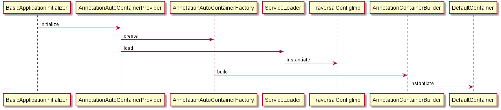

# 内部構造

## 初期化

Initializableを実装したAnnotationAutoContainerProviderをシステムリポジトリに登録しておく。
システムリポジトリ構築のタイミングで初期化処理が実行される。


アノテーションを付与されたクラスをクラスパスからスキャンし、コンテナが構築される。



## Webアプリケーション上でのDIコンテナ使用

### Actionクラス

RoutesMappingの親クラスのDispatchHandler#handleで、DIコンテナから取得できるようファクトリを経由するよう変更している。
（従来は、ディスパッチ対象のActionをClass#newInstanceで生成）


``` java
    public TResult handle(TData req, ExecutionContext ctx) {

        Handler<TData, TResult> handler = null;
        Object delegate = null;
        String fqn = null;
        Class<?> clazz = null;
        try {
            clazz = getHandlerClass(req, ctx);
            fqn = clazz.getName();
            // 委譲先クラスのインスタンスを生成する
            delegate = delegateFactory.create(clazz);
            
            handler = createHandlerFor(delegate, ctx);
            
        } catch (ClassNotFoundException e) {
```

デフォルトではClass#newInstanceが起動されるが、RoutesMappingにDIコンテナ用ファクトリを設定することで
ActionをDIコンテナから取得できるようになる。

``` java
public final class ContainerLookupDelegateFactory implements DelegateFactory {

    @Override
    public Object create(final Class<?> clazz) {
        final Container container = ContainerImplementers.get();
        return container.getComponent(clazz);
    }
}

Actionにはこの時点でFormがインジェクトされている。

```

### Formクラス

BeanValidationStrategy#validateで、DIコンテナから取得できるようファクトリを経由するよう変更している。
（従来は BeanUtil.createAndCopyを使ってMapからインスタンス生成）


```java
    public Serializable validate(HttpRequest request, InjectForm annotation, boolean notUse,
            ServletExecutionContext context) {

        Map<String, String[]> rawRequestParamMap = request.getParamMap();
        Map<String, String[]> requestParamMap = getMapWithConvertedKey(annotation.prefix(), rawRequestParamMap);
        // コンテナからFormを取得
        Serializable bean = formFactory.create(annotation.form());
        // 取得したFormに値をコピー
        BeanUtil.copy(annotation.form(), bean, requestParamMap, CopyOptions.empty());
        Validator validator = ValidatorUtil.getValidator();
        Set<ConstraintViolation<Serializable>> results = validator.validate(bean);
```
